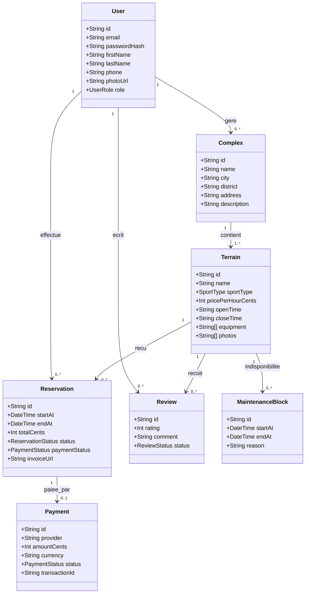

# Diagramme de classes (MVP)

```mermaid
classDiagram
  class User {
    +String id
    +String email
    +String passwordHash
    +String firstName
    +String lastName
    +String phone
    +String photoUrl
    +UserRole role
  }

  class Complex {
    +String id
    +String name
    +String city
    +String district
    +String address
    +String description
  }

  class Terrain {
    +String id
    +String name
    +SportType sportType
    +Int pricePerHourCents
    +String openTime
    +String closeTime
    +String[] equipment
    +String[] photos
  }

  class Reservation {
    +String id
    +DateTime startAt
    +DateTime endAt
    +Int totalCents
    +ReservationStatus status
    +PaymentStatus paymentStatus
    +String invoiceUrl
  }

  class Payment {
    +String id
    +String provider
    +Int amountCents
    +String currency
    +PaymentStatus status
    +String transactionId
  }

  class Review {
    +String id
    +Int rating
    +String comment
    +ReviewStatus status
  }

  class MaintenanceBlock {
    +String id
    +DateTime startAt
    +DateTime endAt
    +String reason
  }

  User "1" --> "0..*" Reservation : effectue
  User "1" --> "0..*" Review : ecrit
  User "1" --> "0..*" Complex : gere
  Complex "1" --> "1..*" Terrain : contient
  Terrain "1" --> "0..*" Reservation : recu
  Terrain "1" --> "0..*" Review : recoit
  Terrain "1" --> "0..*" MaintenanceBlock : indisponibilite
  Reservation "1" --> "0..1" Payment : paiee_par
```
