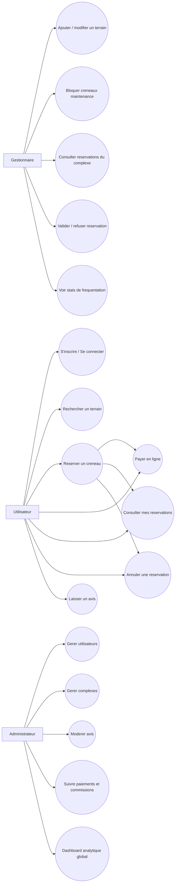

# Diagramme des cas d'utilisation (MVP)

## Priorisation MVP implemente dans ce repo

- Authentification utilisateur (inscription, connexion, deconnexion)
- Recherche terrains par sport, ville, prix
- Reservation avec controle de disponibilite
- Paiement simule (mock provider)
- Dashboard reservations + annulation
- Avis utilisateur apres reservation
